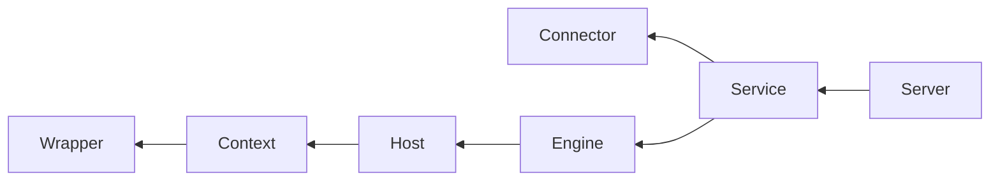

# Tomcat

Tomcat大体架构

## LiFecycle

**tomcat为了便于管理。将所有组件的初始化、启动、停止、销毁等。操作统一抽象，成了一个Lifecycle通用接口。该接口定义了生命周期管理的核心方法。同时，该接口支持组件状态以及状态之间的转换、支持添加事件监听器用于监听组件的状态变化。**

 - init():初始化组件
 - start():启动组件
 - stop():停止组件
 - destroy():销毁组件

同时、这个接口也支持组件状态以及之间的默认转化，支持添加事件监听器(LifecycleListener)用于监听组件的状态变化。
